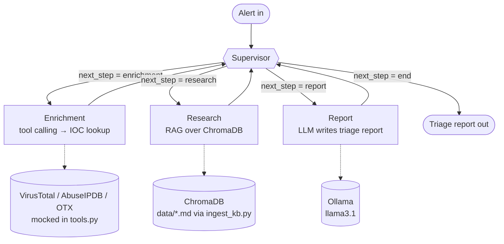

# SOC Agent Orchestrator

Multi-agent system for automated security alert triage, built with
**LangGraph** (orchestration), **Ollama** (local LLM), and **ChromaDB**
(RAG over your own knowledge base: MITRE ATT&CK notes, runbooks, HTB
writeups, Elastic detection rules, etc.).

Built as a portfolio piece for **AI Engineer / Detection Engineer /
Security Automation Engineer** roles, and as a reusable base for a local
"second brain" (same stack: Ollama + ChromaDB + LangChain).

## Architecture



**Diagram source of truth:** this is a hand-drawn view of the graph. To
generate the exact diagram from the running `StateGraph` (stays in sync
with the code automatically), run:

```python
# inside a venv with the project deps installed
from orchestrator import build_graph

app = build_graph()
app.get_graph().draw_mermaid_png(output_file_path="docs/architecture.png")
```

Then embed it in the README with ``
if you prefer a static image over the live Mermaid block above.

**Supervisor-worker** pattern: the supervisor doesn't do any work itself —
it only decides which agent acts next based on the accumulated state. Each
worker does exactly one thing:

- **Enrichment** — uses *tool calling* to extract IOCs from the alert and
  look them up against a threat intel feed (mocked here; swap in
  VirusTotal/AbuseIPDB/OTX/your SIEM).
- **Research (RAG)** — searches your local knowledge base (ChromaDB) for
  relevant context (MITRE techniques, playbooks) for that alert.
- **Report** — writes the final triage report with severity and
  recommended action.

This pattern scales: you can add more agents (DFIR, Elastic queries,
detection-rule generation) without touching the existing ones, just by
wiring new nodes into the graph.

## API (webhook trigger)

The same graph is also reachable over HTTP via `api.py` (FastAPI), so a
real SIEM or an n8n workflow can trigger triage automatically instead of
someone running the CLI demo by hand.

**Live demo:** [soc-api.aigis-cloud.com/docs](https://soc-api.aigis-cloud.com/docs)
— routed through a Cloudflare Tunnel to a local Docker Compose stack
(Ollama + ChromaDB + FastAPI), so it's only reachable while that stack is
running on the host. `/health` is a quick way to check it's currently up.

| Method | Path | Description |
|---|---|---|
| `GET` | `/health` | Liveness check |
| `POST` | `/triage` | Runs the full pipeline on `alert_raw`, returns enrichment, research, and the final report |
| `GET` | `/docs` | Interactive Swagger UI (auto-generated by FastAPI) |

```bash
curl https://soc-api.aigis-cloud.com/health

curl -X POST https://soc-api.aigis-cloud.com/triage \
  -H "Content-Type: application/json" \
  -d '{"alert_raw": "[EDR ALERT] Host: WKS-FINANCE-07 ...", "alert_id": "wazuh-100002"}'

# or run it yourself instead of hitting the live demo:
uvicorn api:app --reload --port 8000
```

`alert_id` is optional and just echoed back, for correlating the response
with the originating SIEM alert. Point an n8n **Webhook** node's HTTP
Request step at `POST https://soc-api.aigis-cloud.com/triage` to wire
this into a real Elastic/Wazuh alert flow (see Roadmap).

## Why this stack

| Decision | Reason |
|---|---|
| LangGraph over a manual loop | Explicit typed state, conditional branching, easy to debug and extend — the pattern used in production by AI Engineering teams, a good signal for a portfolio |
| Ollama (local model) | Zero cost, sensitive data (security alerts) never leaves your machine, reusable across your "second brain" stack |
| ChromaDB | Lightweight, embedded, zero infrastructure — ideal for local RAG |
| Native tool calling instead of manual prompt parsing | More reliable, the same pattern you'll use in any production agent stack (also applies to MCP) |

## How to run it

### Option A: local (Python + venv)

```bash
python -m venv .venv && source .venv/bin/activate
pip install -r requirements-dev.txt   # includes ruff and pytest
cp .env.example .env                  # fill in keys if you're using real APIs

ollama pull llama3.1
ollama pull nomic-embed-text

python ingest_kb.py       # builds the RAG index from data/*.md
python orchestrator.py    # CLI demo: runs the triage on the sample alert
uvicorn api:app --reload  # or: run it as an API instead (see "API" above)
```

### Option B: Docker

```bash
docker compose up --build
# in another terminal, the first time, pull the models inside the container:
docker exec -it soc-orchestrator-ollama ollama pull llama3.1
docker exec -it soc-orchestrator-ollama ollama pull nomic-embed-text
docker compose restart app
# the container runs the API by default: http://localhost:8000/docs
# for the one-shot CLI demo instead:
docker compose exec app python orchestrator.py
```

### Tests

```bash
PYTHONPATH=. pytest tests/ -v   # doesn't require Ollama running
ruff check .                    # lint
```

## Security: API keys and secrets

This project runs 100% locally (Ollama), so it doesn't need any key by
default. If you extend it with real APIs (VirusTotal, OpenAI, a cloud
LLM), follow this rule: **keys never go in the code and never get
committed.**

- Store them in a local `.env` file (already in `.gitignore` — check
  `git status` before every commit to make sure it doesn't show up).
- Use `.env.example` as a public template (no real values) so anyone
  cloning the repo knows which variables they need.
- Load variables with `python-dotenv` (`load_dotenv()`), as
  `orchestrator.py` already does, and access them via
  `os.environ.get(...)`.
- Before your first `git push`, run a secrets scanner (`gitleaks detect`
  or `trufflehog filesystem .`) to make sure no key ended up in the
  history.
- If you later wire this into a pipeline or production, store keys as
  GitHub Actions *Repository Secrets* (Settings → Secrets and variables →
  Actions) instead of a `.env` file — never put them directly in the
  workflow YAML.

## Roadmap

1. **Real data**: replace `data/mitre_notes.md` with your own HTB notes,
   Elastic detection rules, or an export from your knowledge vault.
2. **Real tools**: connect `tools.py` to real APIs (VirusTotal,
   AbuseIPDB) or, better, to your own MCP servers.
3. **Real trigger**: the pipeline is now reachable over HTTP (`POST
   /triage`, see "API" above) — what's left is wiring an actual n8n
   workflow so a SIEM/Elastic alert calls it automatically, and
   publishing the resulting report to Slack or Obsidian.
4. **Human in the loop**: add an "awaiting approval" node before any
   destructive action (isolate a host, block an IP) — the standard
   pattern for production security agents.
5. **Evaluation**: log (alert, report) pairs and build a regression set
   to measure whether prompt/model changes improve or degrade triage
   quality.

## Portfolio value

- Demonstrates multi-agent orchestration (not just "a prompt with RAG"),
  which is what sets an AI Engineer apart from someone who just calls an
  API.
- Connects directly to Blue Team / Detection Engineering goals: it's a
  tool a real SOC would actually use.
- 100% reproducible at zero cost (local model), so any recruiter can
  clone it and run it.
- Publish it on GitHub with a GIF of it running and a short blog post
  explaining the supervisor-worker pattern.
